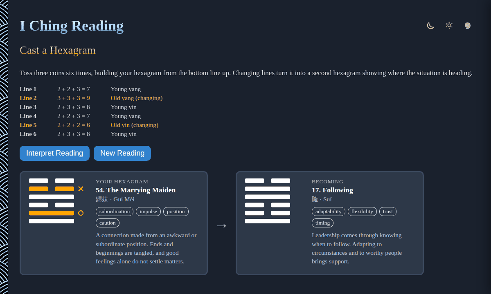

# I-Ching-Reading

Cast an I Ching reading right in your browser: toss three coins six times to build a hexagram from the bottom line up, with changing lines and the second hexagram they turn it into. No sign-up and no libraries.

- [Cast a hexagram](https://evoluteur.github.io/i-ching-reading/)

## What it does

Press **Toss Coins** to throw three coins for each of the six lines. The coins spin, land, and the line is added to your hexagram, with a log showing each toss and what it made. Click a hexagram for its trigrams, its meaning and its advice, or press **Interpret Reading** to see the whole reading laid out.

The traditional three-coin method gives each toss a total between 6 and 9 (heads counts 3, tails counts 2):

| Total | Line | Meaning |
| ----- | ---- | ------- |
| 6 | broken, marked with a cross | old yin, **changing** |
| 7 | solid | young yang, stable |
| 8 | broken | young yin, stable |
| 9 | solid, marked with a ring | old yang, **changing** |

Changing lines are where the situation is in motion. Each one flips to its opposite in a second hexagram, so a reading with changing lines gives you two hexagrams: **Your hexagram** (where things stand) and **Becoming** (where they are heading). A reading with no changing lines is stable, and the first hexagram is the whole answer.

## The interpretation

**Interpret Reading** lays the reading out in three parts:

- **The Situation**: your hexagram, with its name, Chinese character, pinyin, keywords and summary.
- **What Is Changing**: a short note for each changing line, by its position from the first line (the foundation) up to the sixth line (the culmination).
- **Where It Is Heading**: the second hexagram, if any lines changed.

## The hexagrams

All 64 hexagrams are included, in the traditional King Wen sequence, each built from two of the eight trigrams (Heaven, Earth, Thunder, Water, Mountain, Wind, Fire and Lake). Each one has its number, Chinese name, pinyin, English name, keywords, a summary and a line of advice.

The names, characters and trigram structure are the traditional ones. The keywords, summaries and advice are original wording written for this app, and no translation text is reproduced. A reading is a mirror for your own judgment, not a verdict.

## How it is built

The pages are plain HTML, CSS and JavaScript, with no dependencies and no build step. Just open `index.html`.

- The hexagrams are drawn as SVG, so they look the same everywhere.
- The hexagram data is in [js/iching-data.js](https://github.com/evoluteur/i-ching-reading/blob/main/js/iching-data.js), and the app logic in [js/iching.js](https://github.com/evoluteur/i-ching-reading/blob/main/js/iching.js).
- Three color themes (dark, light and blue) are shared with my other projects.
- The reading in progress is kept in the browser's local storage, so reloading the page picks up where you left off.

I-Ching-Reading is open source at [GitHub](https://github.com/evoluteur/i-ching-reading) with MIT license.

Had fun browsing the app? [Buy me a coffee by becoming a sponsor](https://github.com/sponsors/evoluteur).

You may also be interested in my other divination projects [Tarot-Reading](https://github.com/evoluteur/tarot-reading) ([demo](https://evoluteur.github.io/tarot-reading/)), [Rune-Reading](https://github.com/evoluteur/rune-reading) ([demo](https://evoluteur.github.io/rune-reading/)) and [Motivational-Numerology](https://github.com/evoluteur/motivational-numerology) ([demo](https://evoluteur.github.io/motivational-numerology/)). For more mystic arts as small web apps, see [Esoterica](https://evoluteur.github.io/projects/esoterica.html).

Copyright (c) 2026 [Olivier Giulieri](https://evoluteur.github.io/).
